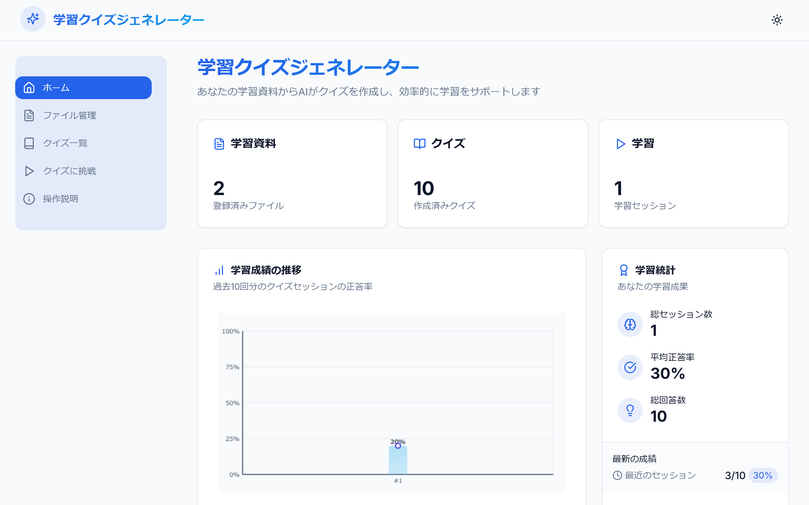
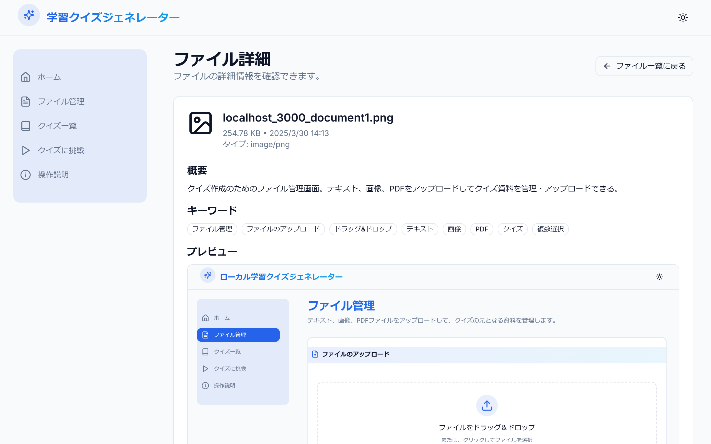
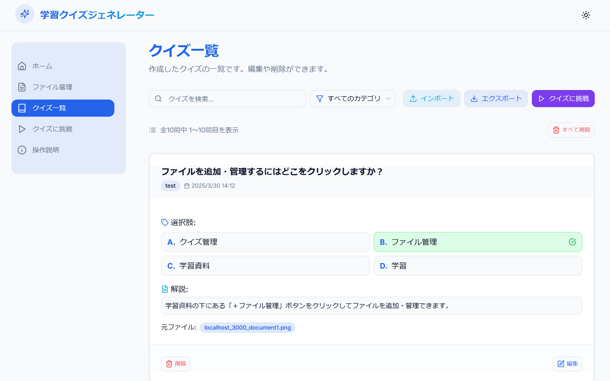
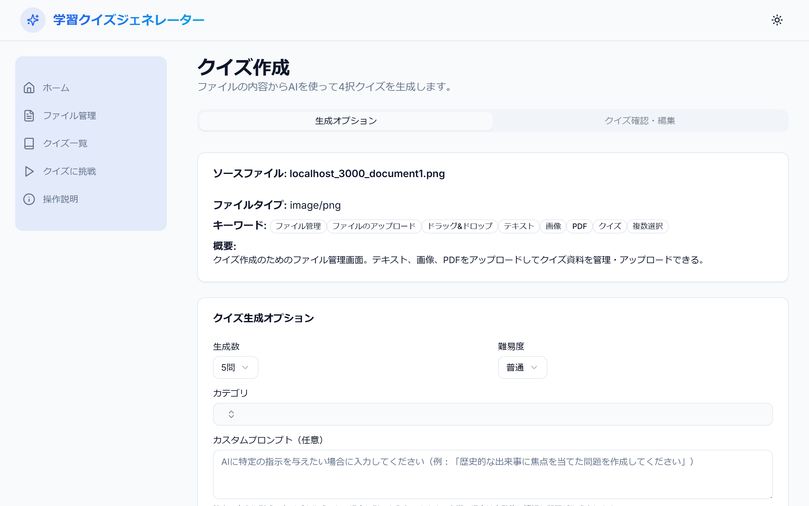
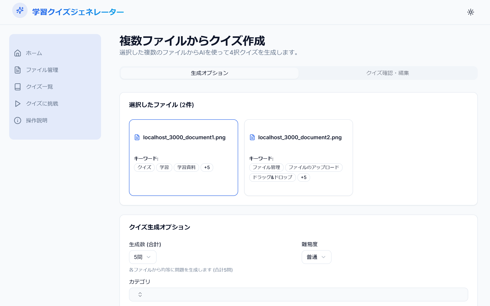
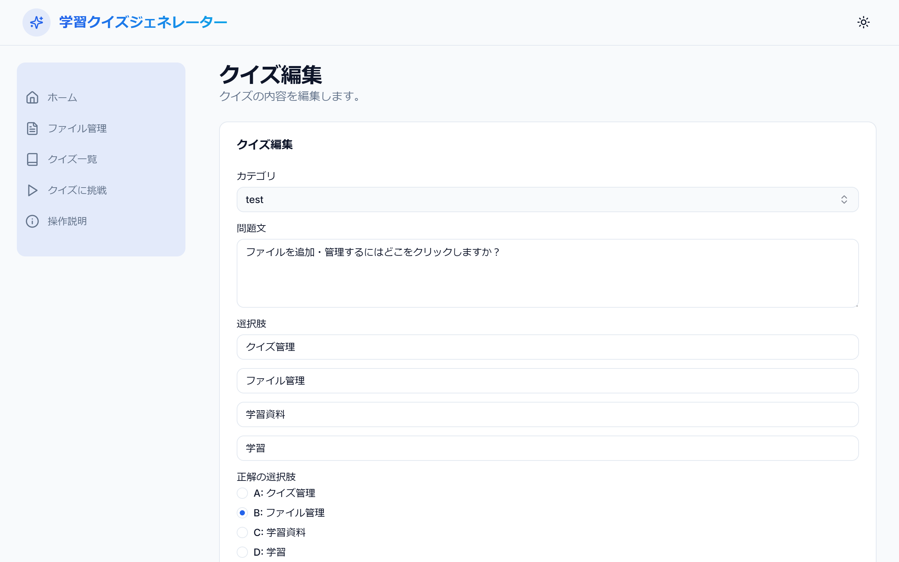
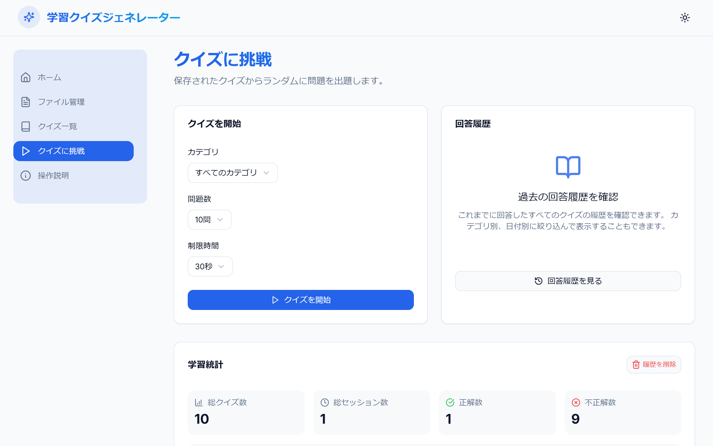
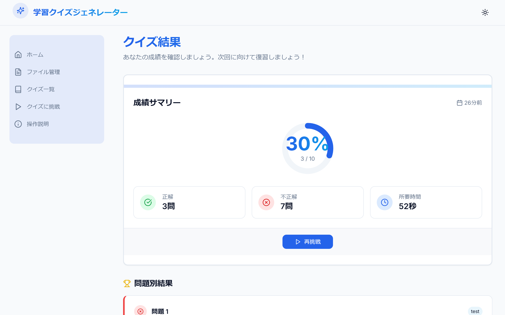

## 学習クイズジェネレーター 操作説明

こんにちは！「学習クイズジェネレーター」へようこそ。
このアプリは、あなたが持っているテキストファイル、画像ファイル、PDF ファイルをもとに、AI が自動で 4 択クイズを作成してくれる学習ツールです。自分で作った資料から手軽に復習用のクイズが作れるので、効率的に知識を定着させることができます。

**【！】注意点**

- **AI の利用について**: クイズを作るために、Google の AI「Gemini」を使っています。AI の学習に利用される可能性があるので、**大切な個人情報や会社の機密情報などはアップロードしないでくださいね**。
- **データの保存場所**: 作成したクイズや学習の記録は、**今使っているブラウザの中 (IndexedDB) に保存されます**。他のパソコンやスマホで同じデータを使いたい場合は、「エクスポート」と「インポート」機能を使ってデータを移動させてください。

---

### 主な画面と使い方

アプリを開くと、まず「ホームページ」が表示されます。ここから色々な機能にアクセスできます。画面上部（またはスマホの場合は下部）のメニューからも移動できます。

**1. ホーム画面 (`/`)**

- **ここは何をするところ？**: アプリ全体の状況が一目でわかるダッシュボードです。
- **できること**:
  - **学習の状況**: アップロードしたファイルの数、作ったクイズの数、挑戦した回数などがわかります。
  - **成績グラフ**: 最近のクイズの正答率がグラフで表示されます。
  - **統計**: 全体の正解率などがわかります。
  - **各機能へ移動**: 「ファイル管理」「クイズ管理」「クイズに挑戦」などのボタンから、それぞれの画面へすぐに移動できます。

**2. ファイル管理 (`/files`)**

- **ここは何をするところ？**: クイズを作るための元になるファイルをアップロードしたり、管理したりする場所です。
- **できること**:
  - **ファイルアップロード**:
    - テキスト (`.txt`)、画像 (`.jpg`, `.jpeg`, `.png`)、PDF (`.pdf`) ファイルをアップロードできます。
    - 点線で囲まれたエリアにファイルをドラッグ＆ドロップするか、「ファイルを選択」ボタンで選びます。
    - アップロードすると、AI がファイルの中身を読み取って、キーワードや簡単なまとめを作ってくれます（少し時間がかかることがあります）。進捗バーが表示されます。
  - **ファイル一覧**: アップロードしたファイルがカード形式で表示されます。ファイル名やキーワード（一部）が見えます。
  - **ファイル操作**:
    - **詳細**: ファイルカードの「詳細」ボタンで、ファイルの中身や AI の解析結果を詳しく見れます。
    - **クイズ作成**: 「クイズ作成」ボタンで、そのファイルからクイズを作る画面に進みます。
    - **削除**: 「削除」ボタンでファイルを削除します。（**注意**: ファイルを消しても、そのファイルから作ったクイズは消えません）
    - **複数選択**: 「複数選択」ボタンを押すと、ファイルを選べるようになります。チェックを入れたファイルからまとめてクイズを作ることもできます。終わったら「選択モード終了」を押してください。
    - **すべて削除**: 右上の「すべてのファイルを削除」ボタンで、アップロードしたファイルを全部消せます（確認メッセージが出ます）。

**3. ファイル詳細 (`/files/[ファイルID]`)**

- **ここは何をするところ？**: アップロードしたファイルの中身や、AI が解析した結果を詳しく見る場所です。
- **できること**:
  - **ファイル情報**: ファイル名、サイズ、アップロード日時などがわかります。
  - **AI 解析結果**: AI が考えたファイルの「概要」「キーワード」「構成」が表示されます。
  - **プレビュー/テキスト**: 画像ならプレビュー、テキストや PDF なら抽出された文字が表示されます。
  - **ダウンロード**: 元のファイルをダウンロードできます。
  - **クイズ作成**: このファイルを使ってクイズ作成画面に進めます。
  - **戻る**: ファイル管理画面に戻ります。

**4. クイズ一覧 (`/quizzes`)**

- **ここは何をするところ？**: 作成・保存したクイズを確認したり、管理したりする場所です。
- **できること**:
  - **クイズ一覧**: 作ったクイズがカード形式で表示されます。問題文や選択肢（正解にマーク付き）、カテゴリなどが見えます。
  - **検索・絞り込み**: 上部の検索ボックスやカテゴリ選択で、見たいクイズを探せます。
  - **クイズ操作**:
    - **編集**: 「編集」ボタンでクイズの内容を修正できます。
    - **削除**: 「削除」ボタンでクイズを削除します。（**注意**: 関連する回答履歴も一緒に削除されます）
    - **すべて削除**: 右上の「すべて削除」ボタンで、すべてのクイズと回答履歴を消せます（確認メッセージが出ます）。
  - **インポート/エクスポート**:
    - **インポート**: 他の場所で作ったクイズデータ（JSON 形式）を読み込めます。
    - **エクスポート**: 選択したクイズを JSON ファイルとして保存できます。他のデバイスで使いたい時に便利です。
  - **クイズに挑戦**: ここからクイズプレイ画面へ移動できます。
  - **ページ移動**: クイズがたくさんある場合は、ページ下部のボタンでページをめくれます。

**5. クイズ作成（単一ファイル） (`/quizzes/create?fileId=...`)**

- **ここは何をするところ？**: 1 つのファイルから AI を使ってクイズを作る場所です。
- **できること**:
  - **ソースファイル情報**: クイズの元になるファイルの情報が表示されます。
  - **生成オプション設定**:
    - 作りたい問題数、難易度（簡単/普通/難しい）、カテゴリ（既存のものを選ぶか、新しく作る）を設定します。
    - AI に特別な指示（カスタムプロンプト）を出すこともできます（任意）。
  - **クイズ生成**: 「クイズを自動生成」ボタンを押すと、AI がクイズを作ってくれます。生成中はローディングが表示されます。
  - **確認・編集**: 生成が終わると「クイズ確認・編集」タブに切り替わります。
    - 生成されたクイズの内容を確認します。
    - 保存したいクイズにチェックを入れます（最初は全部チェックされています）。不要なものはチェックを外します。
    - 内容を修正したい場合は、「編集」ボタンで修正モードに入り、修正後に「変更を保存」を押します。
  - **保存**: 「選択したクイズを保存」ボタンで、チェックを入れたクイズを保存します。

**6. クイズ作成（複数ファイル） (`/quizzes/create-multi?fileId=...&fileId=...`)**

- **ここは何をするところ？**: 複数のファイルからまとめて AI を使ってクイズを作る場所です。
- **できること**:
  - 基本的な流れは単一ファイル作成と同じです。
  - 「生成数」は、選択したファイル全体での**合計問題数**を指定します。AI が各ファイルから均等に問題を作ろうとします。
  - 確認・編集画面では、どのファイルから作られたクイズかが表示されます。

**7. クイズ編集 (`/quizzes/[クイズID]/edit`)**

- **ここは何をするところ？**: すでに保存されているクイズの内容を修正する場所です。
- **できること**:
  - 問題文、選択肢、正解、解説、カテゴリを自由に変更できます。
  - 変更が終わったら「保存」、やめるなら「キャンセル」を押します。

**8. クイズに挑戦（開始画面） (`/play`)**

- **ここは何をするところ？**: クイズ学習セッションを始めるための設定をする場所です。
- **できること**:
  - **セッション設定**: 学習したいクイズの「カテゴリ」と、1 回あたりの「問題数」、「制限時間」を選びます。
  - **クイズ開始**: 「クイズを開始」ボタンで、実際のクイズ画面に進みます。（クイズがない場合はボタンが押せません）
  - **学習統計**: 全体のクイズ数や正答率などが表示されます。
  - **最近の履歴**: 直近のクイズ結果が表示されます。クリックすると詳細が見れます。
  - **回答履歴**: 「回答履歴を見る」ボタンで、過去すべての履歴を確認できる画面に進みます。
  - **履歴削除**: 「履歴を削除」ボタンで、すべての回答履歴とセッション情報を消せます（確認メッセージが出ます）。

**9. 回答履歴 (`/play/history`)**

- **ここは何をするところ？**: 過去のクイズセッションの記録を詳しく見る場所です。
- **できること**:
  - **履歴一覧**: 過去のセッションがリスト表示されます。検索や絞り込みもできます。クリックするとそのセッションの結果詳細が見れます。
  - **統計情報**: 全体の成績や、日ごとの学習状況などがわかります。

**10. クイズセッション（プレイ中） (`/play/session`)**

- **ここは何をするところ？**: 実際にクイズに答えていく画面です。
- **できること**:
  - **問題と選択肢**: 問題文と 4 つの選択肢が表示されます。
  - **進捗**: 今何問目かがわかります（例: 問題 3 / 10）。
  - **スコア**: 現在の正解数が表示されます。
  - **タイマー**: 各問題の残り時間がカウントダウンされます。
  - **回答**: 正しいと思う選択肢のボタンをクリックします。
  - **正誤判定**: 回答すると、正解か不正解かが色で表示されます（正解: 緑、不正解: 赤）。正解の選択肢も示されます。正解すると紙吹雪が舞うことも！
  - **解説**: 解説があれば表示されます。
  - **次へ**: 回答後、「次の問題」ボタンが表示されます。最後の問題なら「結果を見る」ボタンになります。
  - **時間切れ**: 時間内に答えられないと不正解になり、次の問題へ進むボタンが表示されます。

**11. 結果表示 (`/results?sessionId=...`)**

- **ここは何をするところ？**: 終わったクイズセッションの結果を詳しく見る場所です。
- **できること**:
  - **成績サマリー**: そのセッションの正答率、正解数、かかった時間が表示されます。円グラフでも確認できます。
  - **問題別結果**: 各問題について、自分が選んだ答え、正解、解説が表示されます。復習に役立ちます。
  - **再挑戦**: ボタンでクイズ開始画面に戻り、もう一度クイズに挑戦できます。

---

### その他

- **テーマ切り替え**: 画面右上の太陽 <Sun /> / 月 <Moon /> のアイコンで、画面の見た目（ライトモード/ダークモード）を切り替えられます。
- **ホーム画面に追加 (PWA)**: 対応しているブラウザ（Chrome, Edge など）では、このアプリをスマホやパソコンのホーム画面に追加して、普通のアプリのように使うことができます。

これで基本的な操作はバッチリなはずです！AI と一緒に楽しく学習を進めてくださいね。
