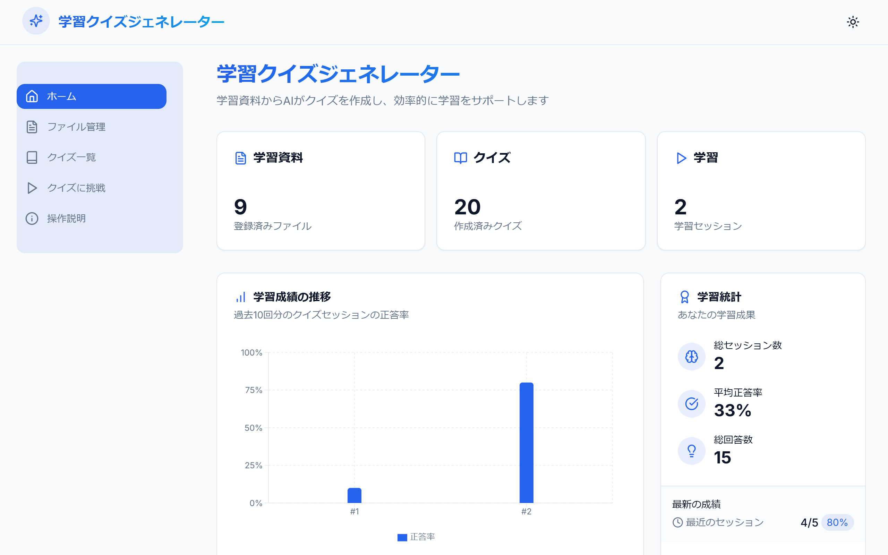
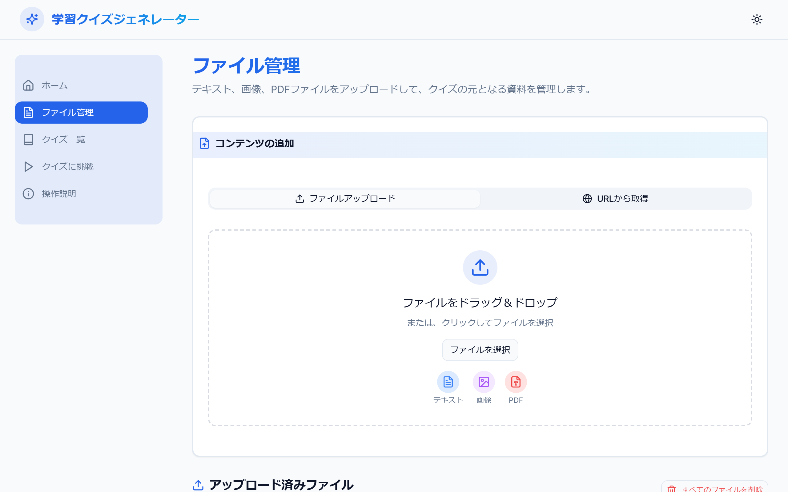
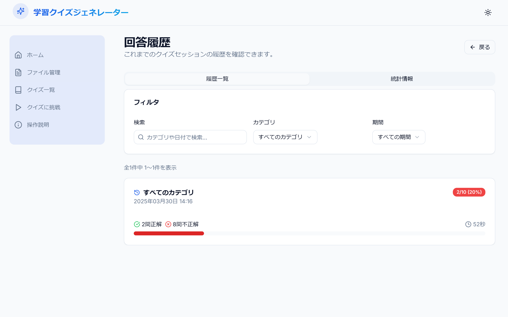
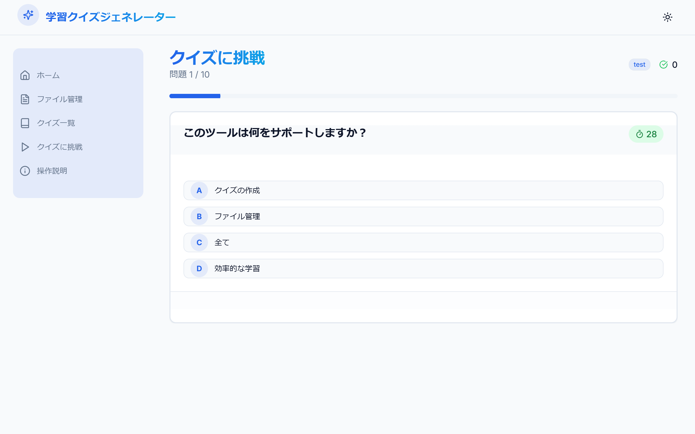
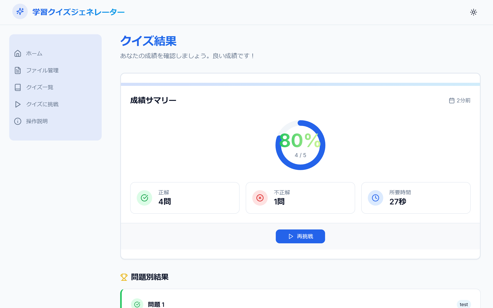

## 学習クイズジェネレーター 操作説明

このアプリケーションは、お手持ちのテキストファイル、画像ファイル、PDF ファイルから AI が自動で 4 択クイズを作成し、学習をサポートするツールです。

作成したクイズはブラウザに保存されるため、別の端末で同じクイズを使用する場合は、クイズのエクスポートとインポートを実施してください。

#### 注意

※ ファイルのアップロード解析時やクイズ生成には、Gemini-2.0-flash を使用しています。AI の学習に使用される可能性があるため、機密情報はアップロードしないでください。

### はじめに

アプリケーションを開くと、まずホームページが表示されます。ここから各機能へアクセスできます。

- **ファイル管理:** クイズの元になるファイルをアップロード・管理します。
- **クイズ一覧:** 作成したクイズを確認・編集・削除します。
- **クイズに挑戦:** 作成したクイズを使って学習します。

画面上部のナビゲーションメニューからも各画面へ移動できます。

### ホームページ (`/`)

**目的:** アプリケーションの概要を確認し、各機能へアクセスします。

**主な機能:**

- **学習統計:** アップロードしたファイル数、作成したクイズ数、挑戦したセッション数が表示されます。
- **学習成績の推移:** 最近のクイズセッションの正答率がグラフで表示されます。
- **学習統計:** 全体のセッション数、回答数、平均正答率などが表示されます。
- **クイックアクセス:**
  - 「ファイル管理」ボタン: ファイル管理画面へ移動します。
  - 「クイズ管理」ボタン: クイズ一覧画面へ移動します。
  - 「クイズに挑戦」ボタン: クイズプレイ画面へ移動します。
  - 「クイズ作成」ボタン: クイズ作成画面へ移動します。

**操作方法:**

- 各カード内のボタンをクリックすると、対応する画面に移動します。
- グラフや統計を見て、学習の進捗を確認できます。

### ファイル管理画面 (`/files`)

**目的:** クイズを作成するための元となるファイルをアップロードし、管理します。

**主な機能:**

- **ファイルアップロード:**
  - テキストファイル (.txt)
  - 画像ファイル (.jpg, .jpeg, .png)
  - PDF ファイル (.pdf)
  - ファイルを指定のエリアにドラッグ＆ドロップするか、「ファイルを選択」ボタンでファイルを選びます。
  - アップロードが完了すると、AI が自動でファイル内容を解析し、キーワードと概要を抽出します（少し時間がかかる場合があります）。
- **アップロード済みファイル一覧:**
  - アップロードしたファイルがカード形式で表示されます。
  - ファイル名、ファイルサイズ、アップロード日時、抽出されたキーワード（一部）が表示されます。
- **ファイル操作:**
  - **詳細:** 各ファイルの「詳細」ボタンをクリックすると、ファイル詳細画面に移動します。
  - **クイズ作成:** 各ファイルの「クイズ作成」ボタンをクリックすると、そのファイルからクイズを作成する画面に移動します。
  - **削除:** 各ファイルの「削除」ボタンをクリックすると、ファイルが削除されます（**注意:** ファイルを削除しても、そのファイルから作成されたクイズは削除されません）。
  - **複数選択:** 「複数選択」ボタンをクリックすると、ファイルを選択できるようになります。
    - 選択したいファイルのチェックボックスをクリックします。
    - 選択後、「選択したファイルからクイズを作成」ボタンをクリックすると、複数のファイルからまとめてクイズを作成する画面に移動します。
    - 再度「選択モード終了」ボタンをクリックすると、選択モードが解除されます。
  - **すべてのファイルを削除:** 画面右上の「すべてのファイルを削除」ボタンをクリックすると、確認ダイアログが表示され、OK するとアップロードしたすべてのファイルが削除されます。

**操作方法:**

1.  **アップロード:**
    - 画面上部の「ファイルのアップロード」エリアにファイルをドラッグ＆ドロップします。
    - または、「ファイルを選択」ボタンをクリックして、ファイルを選びます。
    - アップロードと解析が完了するまで待ちます。プログレスバーが表示されます。
2.  **ファイル確認:** 一覧から目的のファイルを探します。
3.  **操作:** 各ファイルのボタンをクリックして、詳細確認、クイズ作成、削除などを行います。

### ファイル詳細画面 (`/files/[fileId]`)

**目的:** アップロードしたファイルの詳細情報を確認します。

**主な機能:**

- **ファイル情報:** ファイル名、ファイルサイズ、アップロード日時、ファイルタイプが表示されます。
- **AI による解析結果:**
  - **概要:** ファイル内容の簡単なまとめが表示されます。
  - **キーワード:** ファイルから抽出された重要なキーワードが表示されます。
- **プレビュー/テキスト:**
  - 画像ファイルの場合、画像が表示されます。
  - PDF/テキストファイルの場合、抽出されたテキスト内容が表示されます。
- **操作:**
  - **ダウンロード:** 「ダウンロード」ボタンで元のファイルをダウンロードできます。
  - **クイズ作成:** 「このファイルからクイズを作成」ボタンで、このファイルを使ってクイズ作成画面へ移動します。
  - **戻る:** 「ファイル一覧に戻る」ボタンでファイル管理画面へ戻ります。

**操作方法:**

- 画面に表示される情報を確認します。
- 必要に応じて「ダウンロード」や「クイズ作成」ボタンをクリックします。

### クイズ一覧画面 (`/quizzes`)

**目的:** 作成・保存されたクイズを一覧表示し、管理します。

**主な機能:**

- **クイズ一覧:**
  - 作成されたクイズがカード形式で表示されます。
  - 問題文、選択肢（正解にマーク付き）、カテゴリ、作成日、元ファイル名（あれば）が表示されます。
- **検索・絞り込み:**
  - 画面上部の検索ボックスにキーワードを入力すると、問題文、選択肢、解説に含まれるクイズを検索できます。
  - カテゴリ選択プルダウンで、特定のカテゴリのクイズのみを表示できます。
- **クイズ操作:**
  - **編集:** 各クイズの「編集」ボタンをクリックすると、クイズ編集画面に移動します。
  - **削除:** 各クイズの「削除」ボタンをクリックすると、クイズが削除されます（**注意:** 関連する回答履歴も削除されます）。
  - **すべて削除:** 画面右上の「すべて削除」ボタンをクリックすると、確認ダイアログが表示され、OK するとすべてのクイズと回答履歴が削除されます。
- **インポート/エクスポート:**
  - **インポート:** 「インポート」ボタンで、JSON 形式のクイズファイルを読み込めます。
  - **エクスポート:** 「エクスポート」ボタンで、選択したクイズを JSON 形式で保存できます。
- **クイズに挑戦:** 「クイズに挑戦」ボタンで、クイズプレイ画面へ移動します。
- **ページネーション:** クイズが多い場合、ページ下部のコントローラーでページを移動できます。

**操作方法:**

1.  **確認:** 一覧でクイズの内容を確認します。
2.  **検索/絞り込み:** 必要に応じて検索ボックスやカテゴリ選択を使用します。
3.  **操作:** 各クイズのボタンや画面上部のボタンで、編集、削除、インポート/エクスポート、クイズプレイなどを行います。

### クイズ作成画面 (`/quizzes/create`)

**目的:** ファイルから AI を使ってクイズを生成、または手動でクイズを作成します。

**主な機能:**

- **ソースファイル情報 (ファイル指定時):** クイズ作成の元となるファイルの情報（ファイル名、キーワード、概要など）が表示されます。
- **生成オプションタブ:**
  - **生成数:** AI に生成させる問題数を指定します（例: 5 問）。
  - **難易度:** クイズの難易度（簡単、普通、難しい）を選択します。
  - **カテゴリ:** クイズのカテゴリを選択または新規作成します。
    - 既存のカテゴリから選ぶか、「新規カテゴリを作成」を選んで新しいカテゴリ名を入力します。
  - **カスタムプロンプト (任意):** AI に対して、クイズ生成に関する特別な指示（例: 「〇〇に焦点を当てて」）を入力できます。
  - **クイズを自動生成ボタン:** 設定したオプションに基づいて AI がクイズを生成します。
- **クイズ確認・編集タブ (生成後):**
  - AI が生成したクイズの一覧が表示されます。
  - 各クイズの左側にあるチェックボックスで、保存するクイズを選択できます（デフォルトで全選択）。
  - 各クイズの「編集」ボタンで、内容（問題文、選択肢、正解、解説、カテゴリ）を修正できます。
  - **選択したクイズを保存ボタン:** チェックを入れたクイズを保存します。
- **手動作成モード (未実装):** 将来的に、AI を使わずに問題文、選択肢、正解、解説、カテゴリを直接入力してクイズを作成する機能が追加される予定です。

**操作方法 (AI 生成):**

1.  **オプション設定:** 「生成オプション」タブで、生成数、難易度、カテゴリなどを設定します。
2.  **生成実行:** 「クイズを自動生成」ボタンをクリックし、生成が完了するまで待ちます。
3.  **確認・編集:** 生成が完了すると自動的に「クイズ確認・編集」タブに切り替わります。
    - 生成されたクイズの内容を確認します。
    - 不要なクイズがあれば、チェックボックスのチェックを外します。
    - 修正したいクイズがあれば、「編集」ボタンをクリックして編集モードに入り、内容を修正して「変更を保存」ボタンをクリックします。キャンセルする場合は「キャンセル」ボタンをクリックします。
4.  **保存:** 保存したいクイズが選択されていることを確認し、「選択したクイズを保存」ボタンをクリックします。クイズ一覧画面に移動します。

### 複数ファイルからクイズ作成画面 (`/quizzes/create-multi`)

**目的:** 複数のファイルからまとめて AI を使ってクイズを生成します。

**主な機能:**

- **ソースファイル情報:** クイズ作成の元となる複数のファイルの情報が表示されます。
- **生成オプションタブ:**
  - **生成数 (合計):** AI に生成させる合計の問題数を指定します。各ファイルから均等に問題が生成されます。
  - その他のオプション（難易度、カテゴリ、カスタムプロンプト）は単一ファイル作成時と同様です。
  - **クイズを自動生成ボタン:** 設定したオプションに基づいて AI がクイズを生成します。
- **クイズ確認・編集タブ (生成後):**
  - 生成されたクイズの一覧が表示されます。各クイズには、元となったファイル名が表示されます。
  - その他の機能（保存対象の選択、編集、保存）は単一ファイル作成時と同様です。

**操作方法:**

1.  **オプション設定:** 「生成オプション」タブで、合計生成数、難易度、カテゴリなどを設定します。
2.  **生成実行:** 「クイズを自動生成」ボタンをクリックし、生成が完了するまで待ちます。
3.  **確認・編集:** 生成が完了すると自動的に「クイズ確認・編集」タブに切り替わります。
    - 生成されたクイズの内容と、どのファイルから生成されたかを確認します。
    - 不要なクイズがあれば、チェックボックスのチェックを外します。
    - 修正したいクイズがあれば、「編集」ボタンをクリックして編集モードに入り、内容を修正して「変更を保存」ボタンをクリックします。キャンセルする場合は「キャンセル」ボタンをクリックします。
4.  **保存:** 保存したいクイズが選択されていることを確認し、「選択したクイズを保存」ボタンをクリックします。クイズ一覧画面に移動します。

### クイズ編集画面 (`/quizzes/[quizId]/edit`)

**目的:** 既存のクイズの内容を編集します。

**主な機能:**

- **編集フォーム:**
  - カテゴリ、問題文、選択肢（4 つ）、正解の選択肢、解説を編集できます。
  - カテゴリは既存のものから選択するか、新しいカテゴリ名を入力して作成できます。
  - 正解の選択肢はラジオボタンで選びます。
- **操作:**
  - **保存:** 「保存」ボタンで変更内容を保存し、クイズ一覧画面に戻ります。
  - **キャンセル:** 「キャンセル」ボタンで変更を破棄し、クイズ一覧画面に戻ります。

**操作方法:**

1.  **編集:** フォーム内の各項目を必要に応じて修正します。
2.  **保存/キャンセル:** 編集が終わったら「保存」ボタン、変更をやめる場合は「キャンセル」ボタンをクリックします。

### クイズに挑戦画面 (`/play`)

**目的:** 作成したクイズを使って学習セッションを開始します。

**主な機能:**

- **クイズ開始設定:**
  - **カテゴリ:** 学習したいクイズのカテゴリを選択します（「すべてのカテゴリ」も選択可能）。
  - **問題数:** 1 セッションあたりの問題数を選択します（5 問、10 問、15 問、20 問）。
  - **クイズを開始ボタン:** 設定した条件でクイズセッションを開始します。
- **学習統計:**
  - 総クイズ数、総セッション数、総回答数、正解数、不正解数、全体の正答率が表示されます。
  - 最近の学習成績の推移がグラフで表示されます。
- **最近のクイズ履歴:**
  - 直近のクイズセッションの結果（最大 6 件）が表示されます。
  - 各履歴をクリックすると、そのセッションの結果詳細画面に移動します。
- **回答履歴:**
  - 「回答履歴を見る」ボタンで、すべての回答履歴を確認できる画面に移動します。
- **履歴削除:**
  - 「履歴を削除」ボタンで、すべての回答履歴とセッション情報を削除できます（確認ダイアログあり）。

**操作方法:**

1.  **設定:** カテゴリと問題数を選択します。
2.  **開始:** 「クイズを開始」ボタンをクリックすると、クイズセッション画面に移動します。
3.  **履歴確認:** 必要に応じて「回答履歴を見る」ボタンや、最近の履歴カードをクリックします。

### 回答履歴画面 (`/play/history`)

**目的:** 過去のクイズセッションの履歴と統計を詳細に確認します。

**主な機能:**

- **履歴一覧タブ:**
  - 過去のセッションが一覧表示されます（カテゴリ、日時、スコア、正答率など）。
  - 検索ボックスやカテゴリ、期間のプルダウンで履歴を絞り込めます。
  - 各セッションをクリックすると、その結果詳細画面に移動します。
  - ページネーションで多くの履歴を閲覧できます。
- **統計情報タブ:**
  - 総セッション数、総回答数、正解/不正解数、全体の正答率が表示されます。
  - 日別の学習状況（セッション数、スコア、正答率）が表示されます。

**操作方法:**

1.  **タブ選択:** 「履歴一覧」または「統計情報」タブをクリックして表示を切り替えます。
2.  **履歴検索/絞り込み:** 必要に応じて検索ボックスやプルダウンを使用します。
3.  **詳細確認:** 履歴一覧で目的のセッションをクリックします。
4.  **ページ移動:** 履歴が多い場合はページネーションを使用します。

### クイズセッション画面 (`/play/session`)

**目的:** 実際にクイズに回答します。

**主な機能:**

- **問題表示:** 現在の問題文が表示されます。
- **選択肢表示:** 4 つの選択肢がボタン形式で表示されます。
- **進捗表示:** 現在の問題番号と総問題数が表示されます（例: 問題 3 / 10）。
- **スコア表示:** 現在の正解数が表示されます。
- **タイマー:** 各問題の残り時間が表示されます（デフォルト 30 秒）。
- **回答:** 選択肢ボタンをクリックして回答します。
- **正誤判定:** 回答後、選択した選択肢が正解か不正解かが色で示されます。
  - 正解: 緑色
  - 不正解: 赤色（正解の選択肢も緑色で示されます）
- **解説表示:** 回答後、問題に解説があれば表示されます。
- **次の問題へ:** 回答後、「次の問題」ボタンが表示されます。クリックすると次の問題に進みます。
- **結果を見る:** 最後の問題に回答すると、「結果を見る」ボタンが表示されます。クリックすると結果表示画面に移動します。
- **時間切れ:** 制限時間内に回答できなかった場合、自動的に不正解となり、「次の問題」ボタンが表示されます。

**操作方法:**

1.  **問題確認:** 問題文と選択肢を読みます。
2.  **回答:** 正しいと思う選択肢のボタンをクリックします（制限時間内に）。
3.  **確認:** 正誤判定と解説（あれば）を確認します。
4.  **次へ:** 「次の問題」または「結果を見る」ボタンをクリックします。
5.  これを最後の問題まで繰り返します。

### 結果表示画面 (`/results`)

**目的:** 完了したクイズセッションの結果を詳細に確認します。

**主な機能:**

- **成績サマリー:**
  - セッション全体の正答率（%）、正解数/総問題数、所要時間が表示されます。
  - 円グラフで正答率が視覚的に表示されます。
  - カテゴリ（もしあれば）が表示されます。
- **問題別結果:**
  - セッションで出題された各問題について、以下の情報が表示されます。
    - 問題文
    - 自分が選択した選択肢（不正解の場合は打ち消し線）
    - 正解の選択肢（緑色でハイライト）
    - 解説（あれば）
    - 正誤（カード左端の色で示されます: 緑=正解, 赤=不正解）
- **操作:**
  - **ホームへ:** 「ホームへ」ボタンでホームページに戻ります。
  - **再挑戦:** 「再挑戦」ボタンでクイズプレイ画面に戻り、再度クイズに挑戦できます。

**操作方法:**

1.  **結果確認:** 全体の成績と、各問題の正誤、解説を確認して復習します。
2.  **次のアクション:** 「ホームへ」または「再挑戦」ボタンをクリックします。
